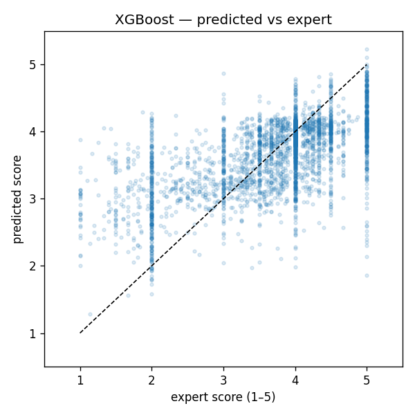
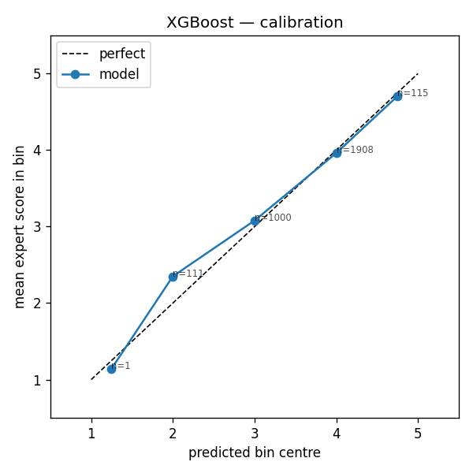
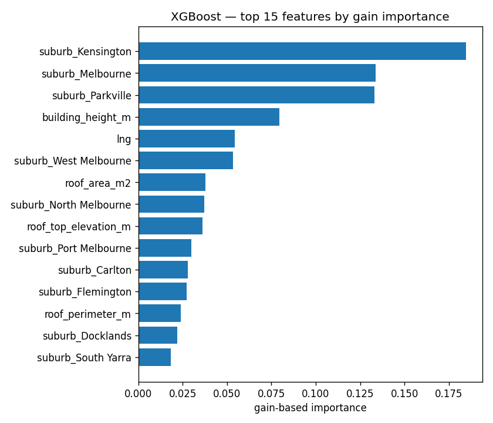

# Solar Score 模型 — 评估报告

由 `evaluate.py` 自动生成，请勿手动修改。

- **生产模型**：XGBoost 回归（5-fold HalvingGridSearchCV 自动调参）
- 有标签样本数：**15687**
- 训练/测试切分：80/20，random_state=42
- 交叉验证折数：5

## Holdout 指标（测试集）

|               |   rmse |    mae |   spearman |   bin5_accuracy |
|:--------------|-------:|-------:|-----------:|----------------:|
| mean_baseline | 0.9447 | 0.7414 |   nan      |          0.5637 |
| xgb           | 0.7478 | 0.56   |     0.5906 |          0.5701 |

*RMSE / MAE 越小越好；Spearman / bin5_accuracy 越大越好。`mean_baseline` 用训练集均值常数预测，仅作下界参考。*

## 训练集 5 折交叉验证

|     |   cv_rmse_mean |   cv_rmse_std |   cv_mae_mean |   cv_mae_std |
|:----|---------------:|--------------:|--------------:|-------------:|
| xgb |         0.7671 |        0.0209 |        0.5761 |       0.0169 |

## XGBoost — 基于 gain 的特征重要性（前 15）

gain importance 反映该特征在所有树节点分裂时带来的总损失下降，数值越大越关键。

| feature                |   gain_importance |
|:-----------------------|------------------:|
| suburb_Kensington      |         0.184671  |
| suburb_Melbourne       |         0.133865  |
| suburb_Parkville       |         0.13309   |
| building_height_m      |         0.0794293 |
| lng                    |         0.0542827 |
| suburb_West Melbourne  |         0.0534795 |
| roof_area_m2           |         0.0378313 |
| suburb_North Melbourne |         0.0373143 |
| roof_top_elevation_m   |         0.0360917 |
| suburb_Port Melbourne  |         0.0300491 |
| suburb_Carlton         |         0.0278054 |
| suburb_Flemington      |         0.0273516 |
| roof_perimeter_m       |         0.0237953 |
| suburb_Docklands       |         0.0221019 |
| suburb_South Yarra     |         0.0183317 |

## 局限性与诚实声明

- **NASA POWER 辐照在墨尔本 CBD 范围内近乎常量**：其原生约 0.5° 分辨率下，训练集里所有建筑都被映射到同一个格点，因此 `VarianceThreshold` 在预处理阶段自动剔除了这些特征。这是模型在如实回答：在当前辐照数据源下，辐照对 CBD 内建筑无区分力。如果未来拿到 BOM 5 km 网格（付费、邮件申请），只需替换这一模块，其余流程不变即可平滑升级。
- **标签本身是主观专家判断**（来源：City of Melbourne 2015 Rooftop Project）。模型学习的是「如何用客观的几何 + 辐照特征复现专家共识」，不是物理意义上的发电量预测器。
- **suburb 是较强的特征**：它吸收了几何特征无法捕捉的空间 / 城市肌理效应。为了对预测力诚实，我们保留它；如果你想要纯几何模型，可以去掉 suburb，但要接受 RMSE 上升。
- **约 23% 的建筑没有标签**：20,462 栋 2015 footprint 中约 4,775 栋没有专家评分（多为很小的附属结构或在调研覆盖范围之外）。`infer.py` 会把模型外推到这些建筑上，但这部分预测应被视为**有依据的外推**，而非已验证的估计。
- **2015 footprint 中跨 struct_id 的几何重复**：原始数据里同 `struct_id` 的多块屋顶分片已经在 `build_features.py` 通过 `dissolve(by='struct_id')` 合并；但另有约 80 对**不同 struct_id 但几何重叠 >80%**（同一栋楼被登记两次）。占样本约 0.4%，对训练指标影响可忽略，因此第一版未做额外去重；如需更严的去重可在预处理中加一道 self-sjoin。

## 图表

- 
- 
- 
